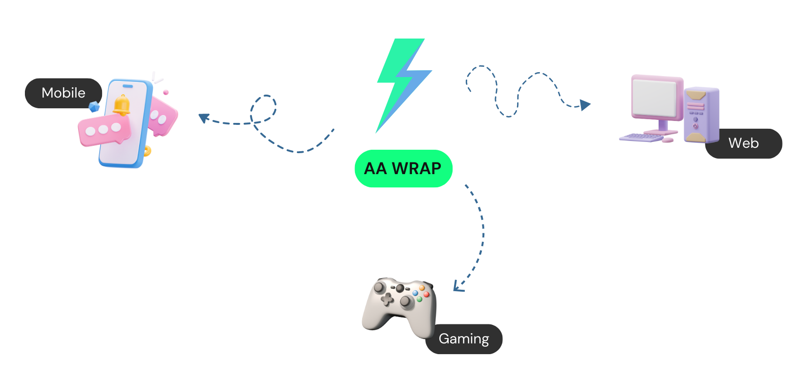

# **AA Wrap Demo** &middot; [](https://shields.io)

## Table of Contents

- [The AA Wrap](#the-account-abstraction-aa-wrap)
- [Demo Overview](#demo-overview)
- [Demo Setup](#demo-setup)
- [Demo Scripts](#demo-scripts)
- [Multiplatform Support: Rust](#multiplatform-support-rust)
- [Scripts Explanation](#scripts-explanation)
- [Community & Contributing](#community--contributing)

## The Account Abstraction (AA) Wrap



The AA Wrap is a Polywrap-powered version of the [Safe Account Abstraction (AA) SDK](https://docs.safe.global/learn/safe-core/safe-core-account-abstraction-sdk).

The Safe AA SDK lets developers build ["smart accounts"](https://docs.safe.global/learn/what-is-a-smart-contract-account), accounts with fully customizable functionality. Smart accounts aim to bring much-needed UX improvements to web3.

Today, the AA Wrap includes functionality to:

- create customizable, secure, and modular smart accounts.
- enable a gas-less user experience via Gelato, offer sponsored transactions, and allow for fee payments in ERC-20 tokens.

## Demo Overview

In this demo, you'll be executing scripts that showcase the AA Wrap's main value props: **multi-platform** and **composability**.


1. **Multi–platform** – The same AA Wrap is fetched from IPFS and then integrated into two different programming environments: JavaScript and Rust.

2. **Composability** – The AA Wrap's functionality can be easily extended by composing it with other Wraps. The current AA Wrap is composed of 3 separate Wraps: Ethers, Gelato Relay and Safe{Core}.

## Demo Setup

First, you'll set up the demo.

1. Create and configure a `.env` file with the following variables (you can use the `RPC_URL` provided below):

```bash
OWNER_ONE_PRIVATE_KEY=
OWNER_TWO_PRIVATE_KEY=
RPC_URL="https://goerli.infura.io/v3/41fbecf847994df5a9652b1210effd8a"
```

2. Create two new accounts in MetaMask for testing purposes. [Export the private keys](https://support.metamask.io/hc/en-us/articles/360015289632-How-to-export-an-account-s-private-key) and input them as values for `OWNER_ONE_PRIVATE_KEY` and `OWNER_TWO_PRIVATE_KEY`.

> ⚠️ Make sure these two accounts are ones that you're only using for testing purposes.

3. Supply your two accounts with Goerli ETH in order to send transactions. You can use a [Goerli faucet](https://goerlifaucet.com/) to do this.

4. Change directory to `js`:

```
cd js
```

5. Update the salt nonce in `./scripts/deploy-safe.ts` to `0x` followed by a few randomly chosen digits. For example,

This salt nonce is used later to create the new Safe address.

```ts
const SALT_NONCE = "0x185593";
```

6. Run the `./scripts/deploy-safe.ts` script to deploy the Safe smart account.

```
yarn deploy
```

> For the purposes of this demo, we're deploying to the Goerli test network. You can view your Safe on [Goerli Etherscan block explorer](https://goerli.etherscan.io/).

7. Add the Safe address in your `.env` file:

You should have received the Safe address after deploying it.

```bash
SAFE_ADDRESS="0x..."
```

Congratulations! You're done configuring the demo and deploying your own Safe smart account. 🥳

### Demo Scripts

The scripts below show complex transactions that your smart account can execute. Run `yarn` and then the script name to execute it.

| Script              | Description                                                   |
| ------------------- | ------------------------------------------------------------- |
| `execute`           | Updates a stored value on a smart contract                    |
| `execute-sponsored` | Uses the Gelato relay Wrap to execute a sponsored transaction |
| `execute-multisend` | Sends transactions to multiple recipients                     |

## Multiplatform Support: Rust

One of the powerful advantages of the AA Wrap is that it can be used in any app, as long as the app has a Polywrap client library installed.

The above scripts were run in a JavaScript environment. We've also prepared scripts that run in **Rust** below.

First, you need to be in the `rs` directory.

Then, update the salt nonce in the `./bin/deploy.rs` file:

```rs
    let deployment_input = DeploymentArgs {
        input: DeploymentInput {
            safe_account_config: AccountConfig {
                owners: vec![signer_address.unwrap()],
                threshold: 1,
            },
            safe_deployment_config: DeploymentConfig {
                salt_nonce: "0x...".to_string(),
            },
            connection: None,
        },
    };
```

Then run:

```
cargo run --bin --release <script>
```

Where `<script>` is one of the following:

| Script                | Description                     |
| --------------------- | ------------------------------- |
| `deploy`              | Deploys your Safe smart account |
| `add_owners`          | Add owners to the Safe          |
| `get_owners`          | Get the list of owners          |
| `sponsor_transaction` | Execute a sponsored transaction |

# Scripts Explanation

This section presents an in-depth look at two of the scripts: multisend and sponsored transactions.

The scripts fetch a chain of Wraps from IPFS.

## Multisend

This script sends test ERC-20 tokens to two separate recipient addresses.

1. Invokes **Ethers Wrap** to get the balance of the Safe
2. Invokes **Ethers Wrap** to mint test ERC-20 tokens to the Safe
3. Invokes **Ethers Wrap** to transfer half the amount of test tokens to `receiverOne`
4. Invokes **Ethers Wrap** to transfer the other half the amount of test tokens to `receiverTwo`
5. Invokes **Safe Wrap** to batch these two transactions into a multisend using `createMultiSendTransaction` method
6. Invokes **Safe Wrap** to add signatures of the two owners to this batch transaction
7. Invokes **Safe Wrap** to `executeTransaction`

## Sponsored Transaction

This script sends a transaction to the Gelato Relayer which executes the transaction on behalf of the user. The user can execute the transaction using ERC-20s instead of ETH, thanks to the Gelato Relayer.

1. Invokes **Ethers Wrap** to store a value `7` on a `storage` smart contract
2. Defines `metaTransactionData` which has the `storage` smart contract address
3. Invokes **Ethers Wrap** to estimate the gas fees in ETH
4. Invokes **Account Abstraction Wrap** to predict the Safe address using `getSafeAddress` method
5. Invokes **Account Abstraction Wrap** to `relayTransaction`, relaying the transaction to update the `storage` contract value to `7`

# Community & Contributing

The AA Wrap was developed and maintained by the [Polywrap DAO](https://polywrap.io/). We believe that the AA Wrap brings a new depth of code re-useability and modularity to the already powerful account abstraction suite that the Safe team built.

To learn more about Polywrap and contribute to the AA Wrap, please join our [Discord community](https://discord.gg/qK9S46gTbF).
